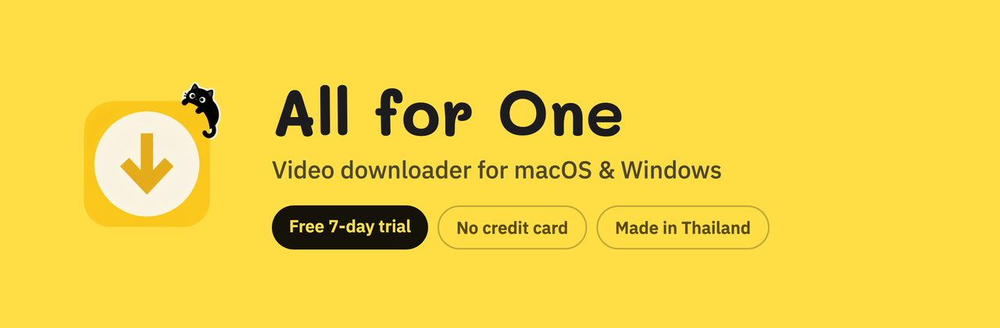
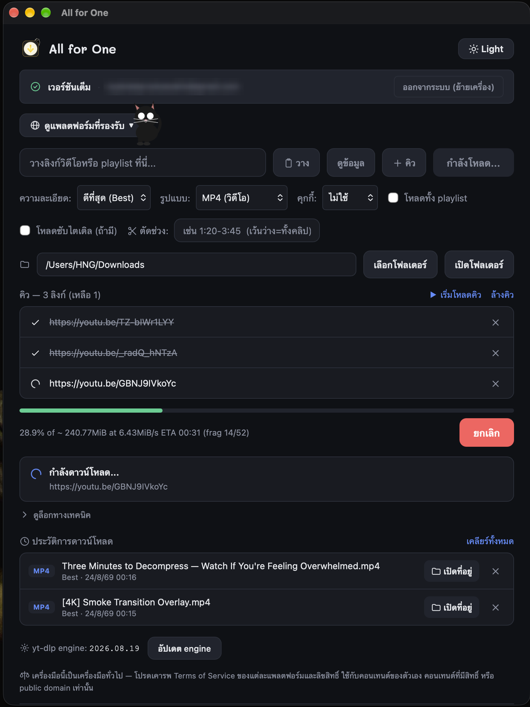

# Save any video to your computer

Paste a link, press one button, the file lands in your folder.
No ads, no pop-ups, no sketchy download sites.

### Free to download · Every feature free for 7 days · No credit card

 

**Made in Thailand 🇹🇭** by an independent developer

---

Heads up: the app's interface is in Thai — it was built for a Thai audience first.

---

## What it does

| | |
|---|---|
| **1,800+ sites** | YouTube, TikTok, Instagram, Facebook, X, Twitch, Reddit, Vimeo, SoundCloud, Bilibili and many more |
| **Up to 4K** | Or pick any size down to 360p — you choose, it doesn't guess |
| **Video or audio** | Keep it as MP4, or pull just the sound out as MP3 |
| **Whole playlists** | Queue an entire playlist and walk away |
| **Subtitles** | Grab them too, when the video has them |
| **Trim** | Take only the part you need — `1:20-3:45` — instead of the whole video |
| **A real queue** | Line up as many links as you like and let it run |
| **Private by default** | Your download history never leaves your computer |

Everything runs on your machine. Nothing is uploaded, and there is no web page in the middle waiting to show you an ad.

---

## Try it free for 7 days

Download the app, sign in with Google, and you're in. No credit card, no payment details, nothing to cancel.

| | Free trial | Full version |
|---|---|---|
| **Price** | Free for 7 days | **฿99** once until **Sep 30** (about US$3) — then ฿299 |
| Downloads per day | 5 | Unlimited |
| Maximum quality | 720p | Up to 4K |
| Download queue | — | ✅ |
| Playlists, subtitles, trim | ✅ | ✅ |
| Computers | 1 | 2 (you can move them yourself) |
| Updates | ✅ | ✅ free, forever |

**Launch price: ฿99 until September 30, 2026.** After that it goes back to the regular ฿299. Whatever you pay, it's once — no subscription, no recurring charge, no account to manage.

Upgrading takes about a minute — pay with PromptPay, your license key arrives by email, paste it into the app.

**[→ Buy the full version](https://all-for-one-backend.vercel.app)**

---

## Install

### macOS — Apple Silicon (M1 and newer)

1. Download the `.dmg` from [the latest release](https://github.com/HNGSeries/all-for-one-releases/releases/latest)
2. Drag **All for One** into your Applications folder
3. **The first time you open it, right-click the app and choose _Open_**, then confirm

> That last step matters. The app is signed but not notarized by Apple — a solo developer would have to pay Apple US$99 every year for that — so macOS shows a warning the first time. Right-click → Open tells macOS you meant to run it. You only ever do this once.

### Windows 10 / 11

1. Download the `Setup.exe` from [the latest release](https://github.com/HNGSeries/all-for-one-releases/releases/latest)
2. Run it
3. If SmartScreen appears, click **More info → Run anyway** — same reason as above

### Updating

You don't have to do anything. The app checks for updates on its own, verifies the signature, and installs them. Versions before 1.3.2 have no updater and need to be reinstalled once by hand.

---

## Frequently asked

<b>Do I need to install anything else — Python, ffmpeg, a browser extension?</b>
 

No. Everything the app needs is bundled inside it. Download, open, paste a link.

<b>Does it work on Intel Macs?</b>
 

Not yet — the macOS build is Apple Silicon only (M1 and newer).

<b>Can I use it on my laptop and my desktop?</b>
 

Yes. One license covers 2 computers, and you can sign out from inside the app to free a slot and move to a different machine yourself.

<b>Is it a subscription?</b>
 

No. You pay once (฿99 during the launch promo, ฿299 after September 30) and it stays yours, updates included. There is nothing to cancel.

<b>Can I download private or age-restricted videos I have access to?</b>
 

The app can borrow cookies from Chrome, Firefox, Edge, Safari or Brave, so anything you can watch while signed in, it can save.

<b>Is there an English interface?</b>
 

Not yet — the app is in Thai. The buttons are simple enough to work out from the screenshot above, but if you'd like an English version, [say so in an issue](https://github.com/HNGSeries/all-for-one-releases/issues) — enough requests and it gets built.

<b>Where do my downloads go?</b>
 

Wherever you point it. The folder is yours to choose, and the history list is stored only on your own computer.

---

## Please download responsibly

This is a general-purpose tool, the same way a screen recorder is. Respect each platform's Terms of Service and other people's copyright — use it for your own content, content you have the rights to, or content in the public domain.

---

**Built in Thailand by one person who got tired of ad-covered download sites.**

Questions or something broken? [Open an issue](https://github.com/HNGSeries/all-for-one-releases/issues).

Downloading is powered by the open-source <a href="https://github.com/yt-dlp/yt-dlp">yt-dlp</a> and <a href="https://ffmpeg.org">FFmpeg</a> projects, bundled inside the app.

